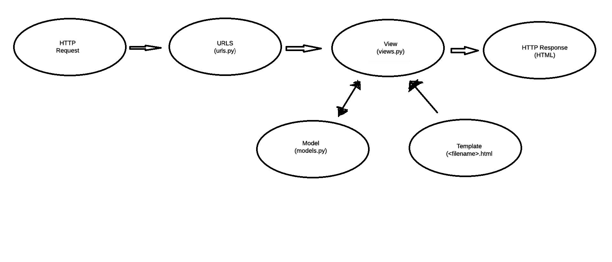

Mochammad Ezar Yudha
2206046746
CS KKI

Assignment 2

1. How do you implement the tasks in the checklist? Explain in a step-by-step manner (not just copy-paste from the tutorial).
>> I first initilize a git repository that will be used as the base of the django project.
> This is done by creating a git repository on github, then creating a local repository and performing add, push, and commit so that the changes can be stored on the central repository on github.

>>Then, I activate a virtual environment

>>Once the virtual environment is set up, I set up and install dependencies for the django project and create the django project

>>The django project utilizes the MVT structure which stands for model, view, and template.

>>The next step is to create the an application called main.

>>Once the application is created, I can start to modify the template in the form of an html file.

>>Next, I can modify the model which essentially serves as a database schema. This contains the item along with its attributes.

>>To keep track of the state of the database schema, I apply migrations.

>>Next, I connect the views to the template. Views acts as a bridge to connect the data retrieved from the model to the template. I do this by creating a function in the views.py file.

>>Once I've implemented the MVT structure, I can configure the url routing so that the application can be accessed through the browser.

>>Next, I can use testing to see if the url can be accessed as intended.

>>Finally, I can perform add, push, and commit to save the changes to the central repository.

2.

3.A virtual environment is used to isolate dependencies and libraries of different projects to prevent errors in the case that an updated library causes clashes with previous versions. We can create a django project without the use of a virtual environment but it is not the best practice.

4.MVC stands for Model, View, and Controller. The model handles all of the data-logic that the user can work with. The View handles the UI logic for the application. Controllers act as an interface between the model and view and processes the incoming requests to create the final output.

MVT stands for Model, View, and Template. The model serves as a database schema which contains the item along with its attributes. The Template serves as an interface for the application. The View serves as a bridge to connect the data retrieved from the model to the template.

MVVM stands for Model, View, and ViewModel. Model hands the data logic. View serves as an interface of the application. ViewModel links the view to the model by data binding.

Assignment 3

1.What is the difference between POST form and GET form in Django?
In post form data submitted is included in the HTTP request body rather than in the URL. This form is suitable when transmitting sensitive data such as login information. On the other hand, data submitted in get form is appended to the URL as query parameters, this may cause security risks.

2.What are the main differences between XML, JSON, and HTML in the context of data delivery?
XML (Extensible Markup Language) is self-descriptive and is used to represent data hierarchically using tags. JSON (JavaScript Object Notation) represents data using key-value pairs. HTML (The HyperText Markup Language) uses tags to structure content on webpages.

3.Why is JSON often used in data exchange between modern web applications?
JSON's readibility is the one of the main reasons why its use so widespead among modern web applications. The representation of data as key-value pairs allow developers to easily understand the structure.

4.Explain how you implemented the checklist above step-by-step (not just following the tutorial).

Create a form input to add a model object to the previous app.
I created a new file called forms.py and added code to accept new data as input. This code consists of a class that contains the variable fields which is used to select the attributes from the model.

Add 5 views to view the added objects in HTML, XML, JSON, XML by ID, and JSON by ID formats.
I created 5 different functions, one for each format, in the views.py file. Each of them will accept Item objects and return the data in their respective formats.

Create URL routing for each of the views added in point 2.
I added the URL paths for each format to the urlpatterns list in urls.py

